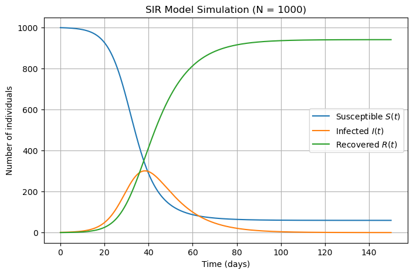
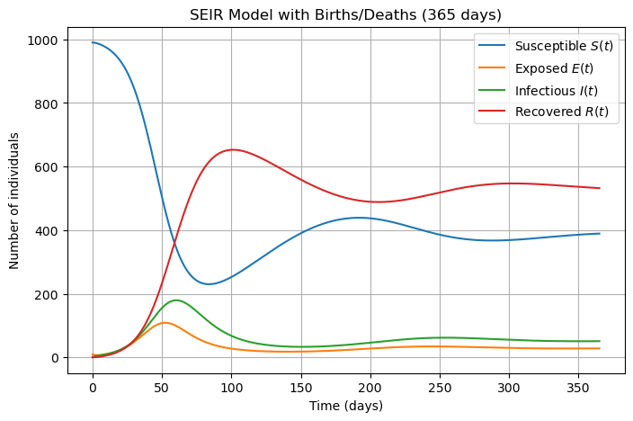
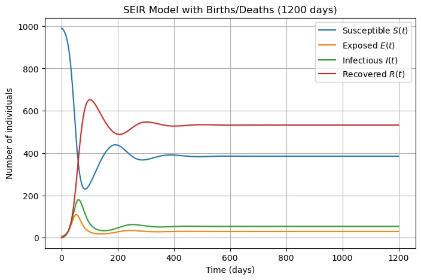
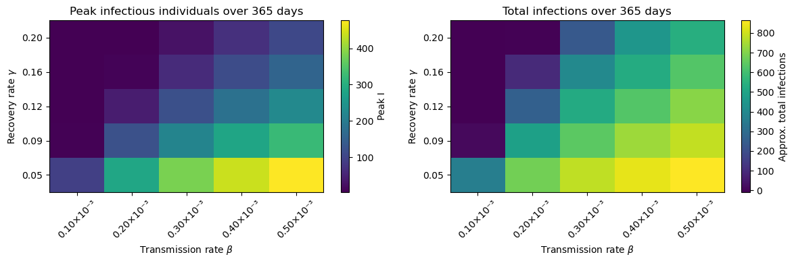

# Ramezan_BMI500_HW11
# HW1 – SIR and SEIR Model Implementation for Pandemic Spread

### Author and Contact

- **Name:** Kimia Ramezan  
- **Course:** BMI 500 
- **Contact:** kimia.ramezan@emory.edu  

---

## Question Selected

This repository contains my solution for:

> **HW1 – SIR and SEIR Model Implementation for Pandemic Spread**

I implemented and analyzed:

1. A **classic SIR model** for epidemic spread in a closed population.  
2. An extended **SEIR model with births and deaths**, including an exposed compartment.  
3. A **sensitivity analysis** on the SEIR model with respect to the transmission rate $\beta$ and recovery rate $\gamma$.

All code and figures are in the notebook:

- `Ramezan_BMI500_HW11.ipynb`

---

## Key Insights

- In the **SIR model**, starting from one infected case in a population of 1000, the infection curve $I(t)$ shows a single pronounced wave:
  - The infection peaks around **38–39 days**, with roughly **300 infected individuals** at the peak.
  - The **basic reproductive number** is approximately $R_0 \approx 3.0$, so each infected person creates about three new infections at the start.
  - By the end of the simulation, most individuals have moved into the recovered compartment, and the epidemic dies out.

- In the **SEIR model with births and deaths**, the dynamics are richer:
  - Introducing an **exposed compartment $E(t)$** adds a delay between infection and infectiousness, which smooths and shifts peaks.
  - Continuous **births and deaths** refill the susceptible pool and prevent permanent herd immunity.
  - Over longer time horizons (like 1200 days), the system shows **damped waves of infection** and then settles into an **endemic equilibrium** with non-zero $I(t)$.

- The **sensitivity analysis** shows clear trends:
  - Increasing $\beta$ (higher transmission) produces **larger peaks** and **more total infections**.
  - Increasing $\gamma$ (faster recovery) reduces both the peak and overall number of infections.
  - The “worst” region is **high $\beta$, low $\gamma$**; the “best” region is **low $\beta$, high $\gamma$**.

---

## Comparative Model Performance

### SIR (closed population)

- One major wave of infection, then the epidemic dies out as susceptibles are depleted.
- Total population remains fixed and eventually almost everyone is either recovered or still susceptible.
- Good for modeling **single-wave outbreaks** without long-term demographic effects.

### SEIR with births/deaths

- Captures **latent infection** (exposed but not yet infectious), which slows and smooths the dynamics.
- Births keep adding new susceptibles, while deaths prevent $R(t)$ from dominating forever.
- Produces **recurrent waves** and then an **endemic level** of infection, which is more realistic for long-running diseases.
- More parameters, but also more expressive and closer to real public-health situations.

Overall, the SEIR model with demography provides a more realistic description of long-term disease behavior, while the simpler SIR model is easier to analyze and understand.

---

## Relevance to Model-Based Machine Learning

This homework shows several model-based ML ideas:

- **Explicit mechanistic models:** The differential equations define how $S, E, I, R$ evolve. Instead of learning a black-box mapping, we start from domain knowledge (epidemiology) and encode it directly.
- **Simulation as inference:** By simulating the model under different parameter values, we “query” the model about possible futures. This is similar to using mechanistic models as priors or simulators in probabilistic ML.
- **Parameter sensitivity:** The grid over $\beta$ and $\gamma$ plays the role of a simple parameter sweep, revealing which parameters the outcomes are most sensitive to. In ML, similar sensitivity analyses can guide model selection, regularization, and intervention strategies.
- **Connecting parameters to real interventions:** Mapping $\beta$ to contact patterns/social distancing and $\gamma$ to medical treatment shows how **model parameters correspond to actionable levers**, which is central in model-based decision making.

---

## Suggestions for Future Modeling Improvements

Possible extensions that would make the model more realistic and closer to real-world data:

- **Age structure or contact networks:** Split the population into age groups or use a contact network, so that $\beta$ depends on who is interacting with whom.
- **Time-varying parameters:** Let $\beta(t)$ change over time to reflect policy changes (lockdowns, mask mandates, vaccination campaigns).
- **Stochastic dynamics:** Replace purely deterministic ODEs with stochastic models to capture randomness in small populations or early outbreak stages.
- **Parameter estimation from data:** Fit $\beta$, $\gamma$, $\sigma$, and $\mu$ to real case data using maximum likelihood or Bayesian methods, instead of using fixed textbook values.
- **Additional compartments:** Add hospitalization, ICU, or death compartments to study healthcare burden and mortality more directly.

---

## Repository Structure

- `Ramezan_BMI500_HW11.ipynb` – main Jupyter notebook with:
  - SIR model implementation and simulation (Parts A–C),
  - SEIR model with births/deaths (Part D),
  - Sensitivity analysis over $\beta$ and $\gamma$ (Part E),

---

## All the codes and explanations are in the notebook but below you can see the outputs and a brief description as well!

## SIR model (Parts A–C)

This plot shows a single epidemic wave in a closed population of 1000 people: susceptibles $S(t)$ drop sharply as the infection spreads, $I(t)$ rises to one peak around day ~40 and then falls, and $R(t)$ increases until most of the population has recovered.

## SEIR model with births/deaths (Part D)

Over one year, the SEIR model produces a large initial wave of infections followed by smaller ripples: births slowly refill the susceptible pool, the exposed class $E(t)$ adds a delay before people become infectious, and the system begins to oscillate toward an endemic level rather than returning to zero cases.

**365 days:**

Over a longer horizon, the repeated waves in the SEIR model are damped and the system settles into an endemic equilibrium: $S(t)$, $E(t)$, $I(t)$, and $R(t)$ stabilize around roughly constant values, with infections persisting at a low but non-zero level.

**1200 days:**

## Sensitivity analysis (Part E)

These heatmaps summarize how the transmission rate and recovery rate affect the epidemic. Moving right (higher $\beta4) increases both the peak number of infectious individuals and the total infections, while moving up (higher $\gamma\$) reduces them; the worst outcomes occur at high $\beta4 and low $\gamma$, and the best at low $\beta$ and high $\gamma$.

**Disclaimer:** [ChatGPT 5] was used to complete HW #1.[Parts: A–C-D] to (i) review my SIR/SEIR Python code for correctness and (ii) suggest concise interpretations of the SIR/SEIR and sensitivity plots. I implemented and executed all simulations, produced all figures, chose parameters, and wrote the final analysis and README. I have attached a pdf file of the prompts and the GPT answer in this reporitory.

    

